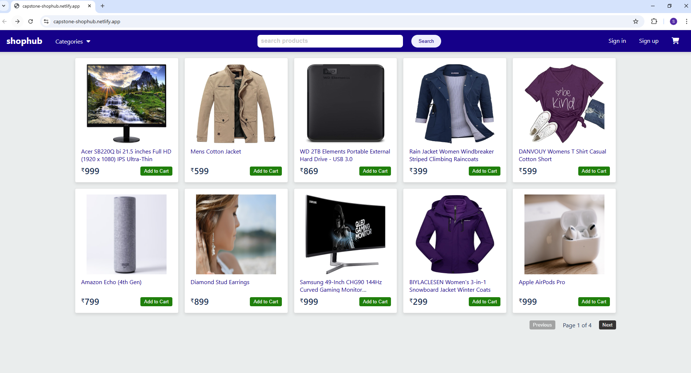
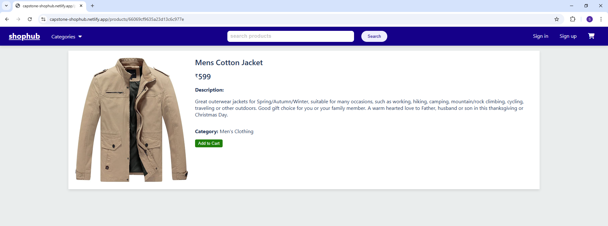
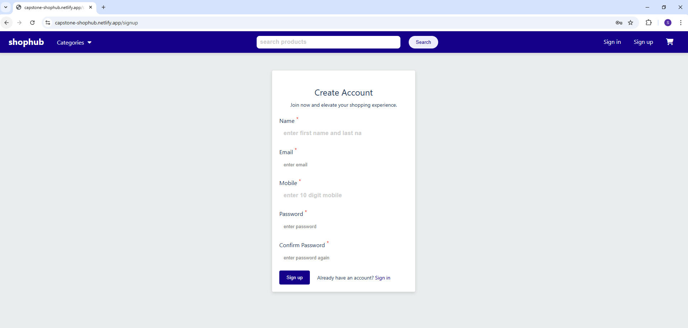
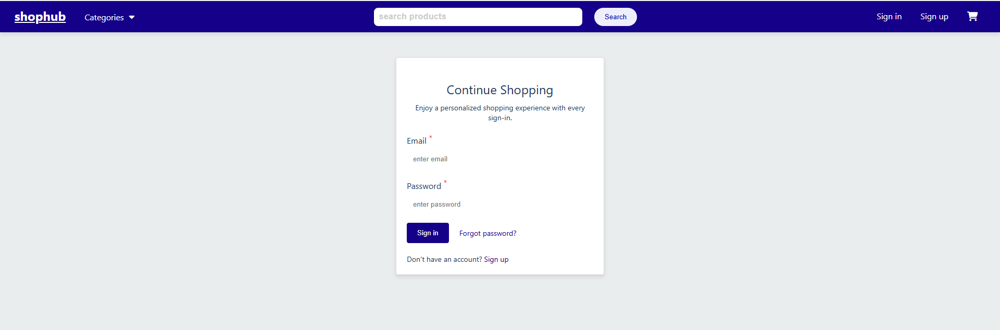
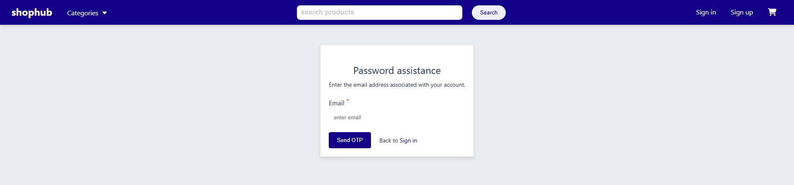
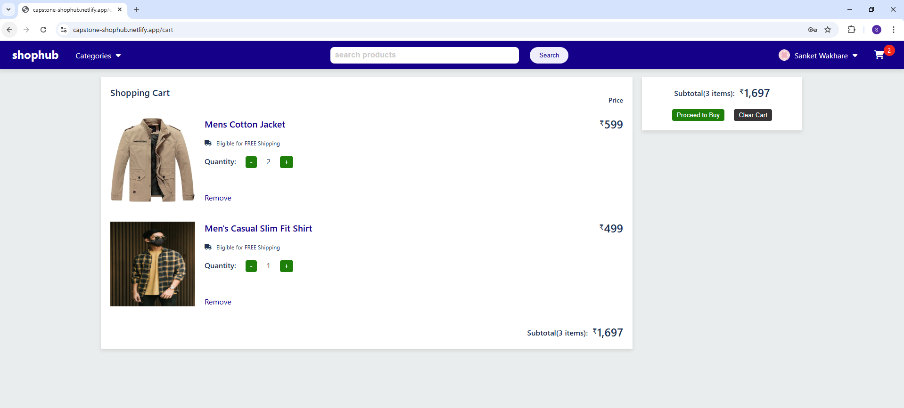
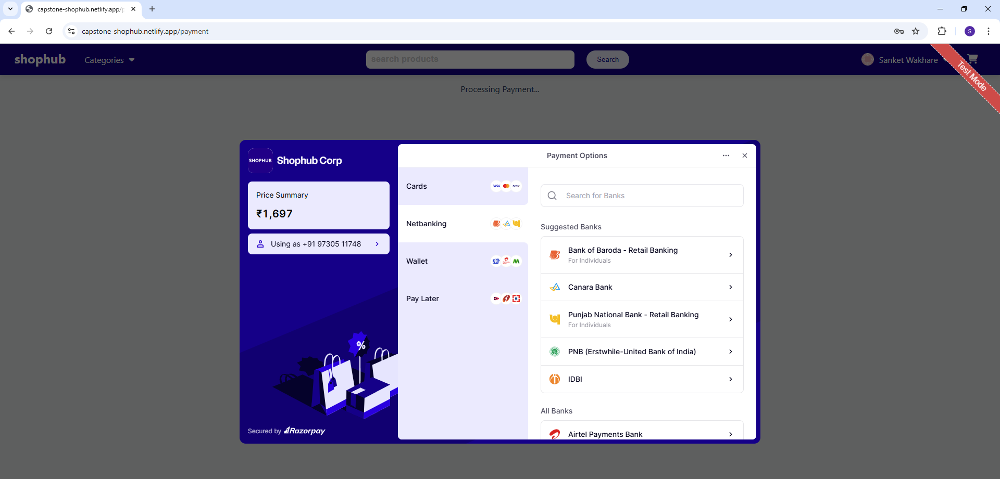
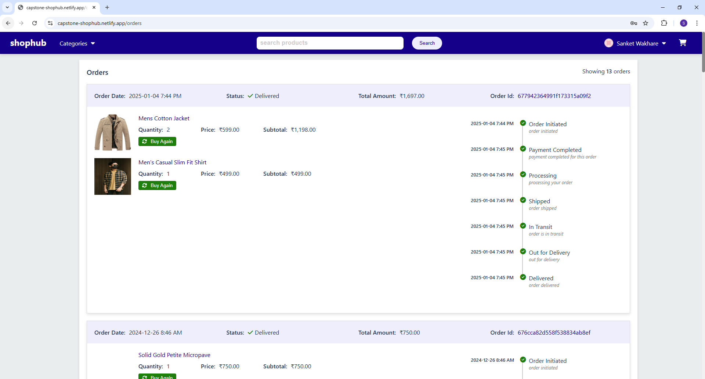
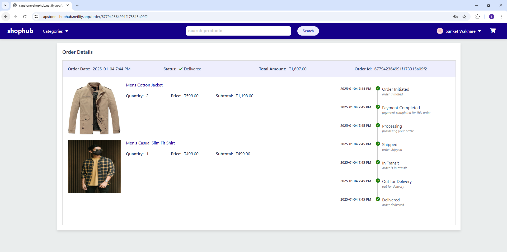

# React Shopping Cart Project

## 📋 Project Overview
The **React Shopping Cart Project** is a web-based e-commerce platform built with **React (JavaScript)** that allows users to browse products, add items to the cart, and complete their purchase. The project demonstrates essential concepts of front-end development, including state management, component reusability, and routing, while integrating a dynamic shopping cart feature.

---

## 🛠️ Features
- **Product Listing Page**: Displays all available products with images, descriptions, and prices.
- **Product Details Page**: View detailed information about a specific product.
- **Search Functionality**: Search products by name or category.
- **Shopping Cart**: Add, remove, and update products in the cart.
- **User Authentication**: Login and signup functionality for users.
- **Order History Page**: View previously placed orders.
- **Payment Integration**: Secure payment processing using Razorpay.
- **Backend Integration**: The app is connected to a backend service built with Node.js for dynamic product data and user authentication.

---

## 🧑‍💻 Tech Stack
- **Frontend**: React (JavaScript), HTML, SCSS
- **State Management**: Redux
- **Routing**: React Router
- **Styling**: SCSS
- **Backend**: Node.js, Express
- **Database**: MongoDB
- **Payment Gateway**: Razorpay

---

## 🚀 Installation

Follow the steps below to run the project locally:

### Prerequisites
Ensure you have the following installed on your machine:
- Node.js (v14 or higher)
- npm or yarn

### Steps to Run the Project

1. **Clone the repository:**
   ```bash
   git clone https://github.com/sanketwakhare/react-shopping-cart-project.git
   ```

2. **Navigate to the project directory:**
   ```bash
   cd react-shopping-cart-project
   ```

3. **Install dependencies:**
   ```bash
   npm install
   ```

4. **Start the development server:**
   ```bash
   npm start
   ```

5. Open your browser and navigate to `http://localhost:3000` to view the application.

---

## 📂 Folder Structure
```plaintext
react-shopping-cart-project
├── public
│   └── index.html
├── src
│   ├── assets
│   │   └── images
│   ├── components
│   ├── context
│   ├── pages
│   ├── store
│   ├── styles
│   │   └── style.scss
│   ├── App.jsx
│   └── index.js
├── .env
├── package.json
└── README.md
```

---

## 📸 Screenshots

1. **Home Page**

2. **Product Details Page**

3. **Sign up Page**

4. **Sign in Page**

5. **Forgot/Reset Password Page**

6. **Cart Page**

7. **Payment Page**

8. **Order Page**

9. **Order Details Page**

---

## 📈 Future Enhancements
Here are some potential future improvements for the project:
- **Product Recommendations**: Implement a recommendation system to suggest products based on user behavior.
- **Wishlist Feature**: Allow users to save products to a wishlist for future reference.
- **Admin Dashboard**: Build an admin dashboard to manage products, orders, and users.
- **Multi-language Support**: Add support for multiple languages to make the app accessible to a broader audience.
- **Unit Testing**: Implement unit tests using tools like Jest to ensure code quality.

---

## 📝 License
This project is licensed under the **MIT License**. Feel free to use, modify, and distribute this project as per the terms of the license.

---

## 📧 Contact
If you have any questions or suggestions, feel free to contact the project maintainer:
- **Sanket Wakhare**
- [GitHub Profile](https://github.com/sanketwakhare)